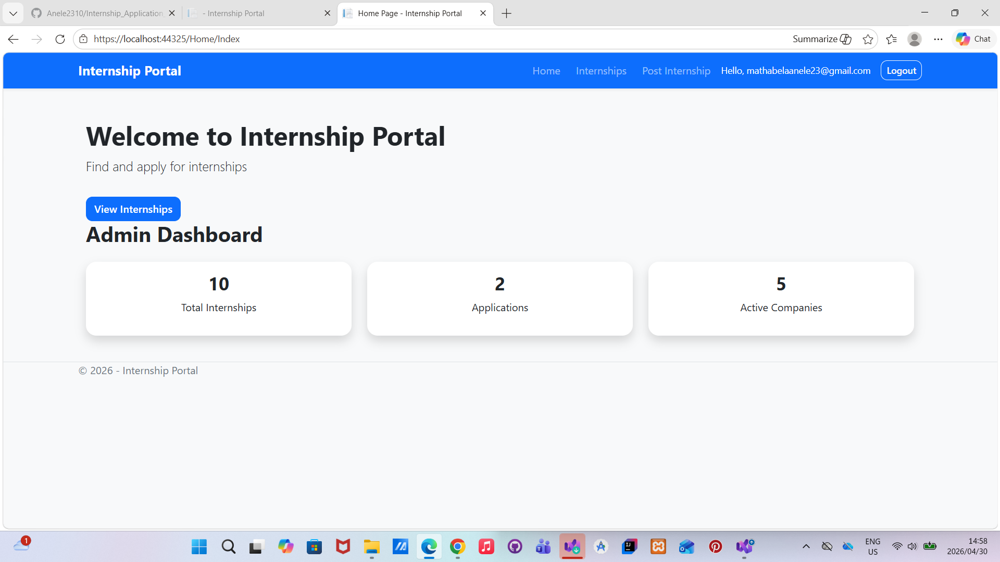
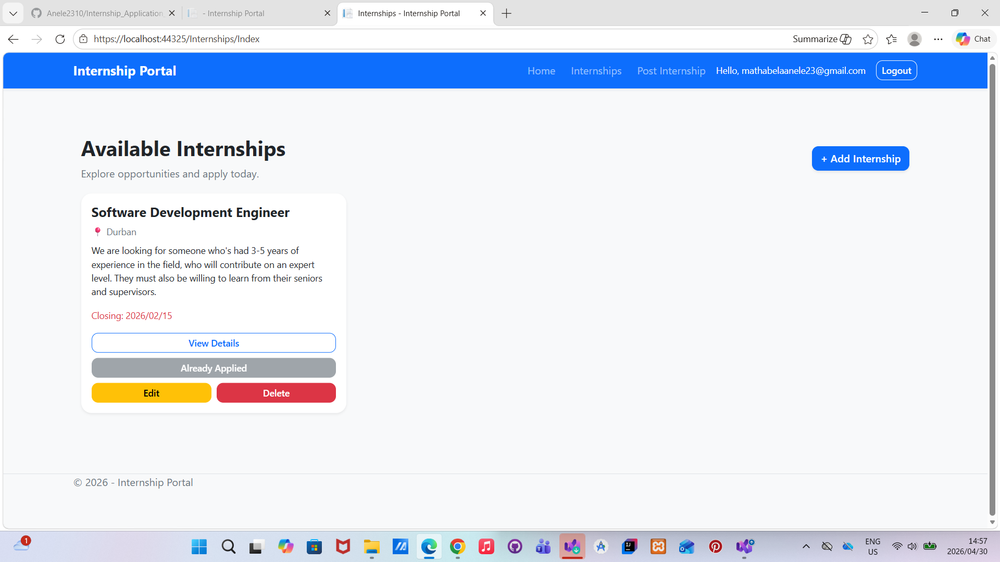
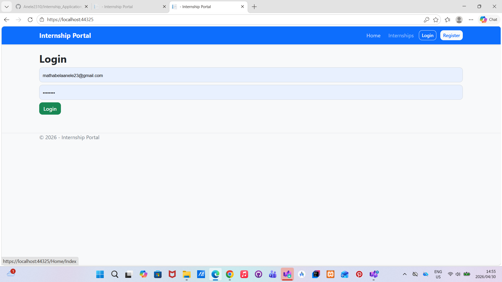
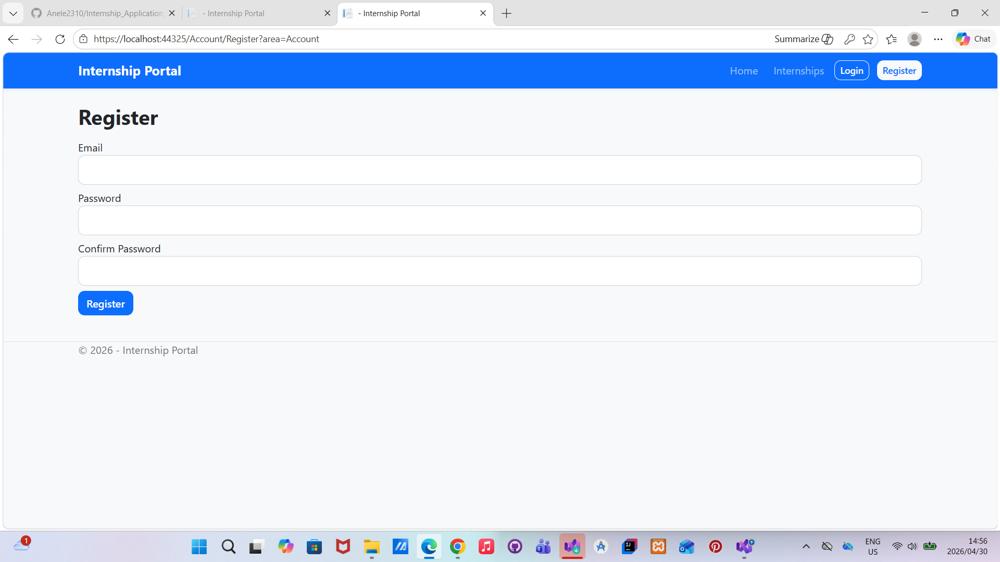
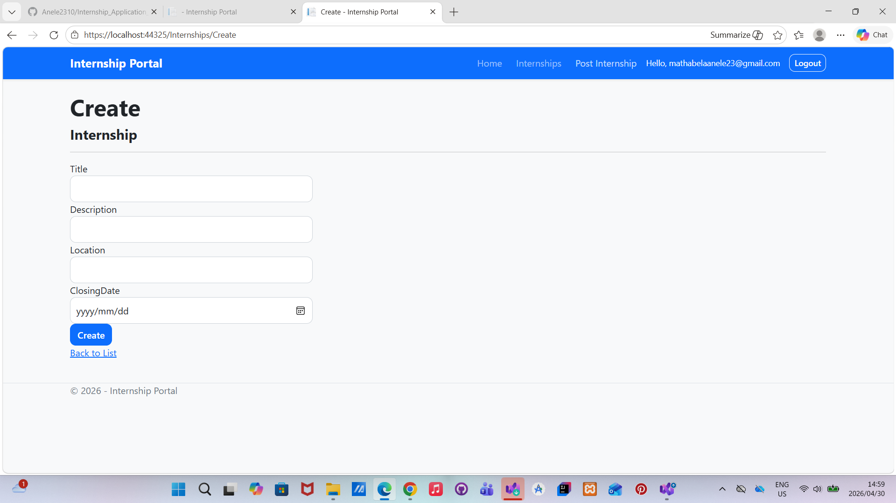
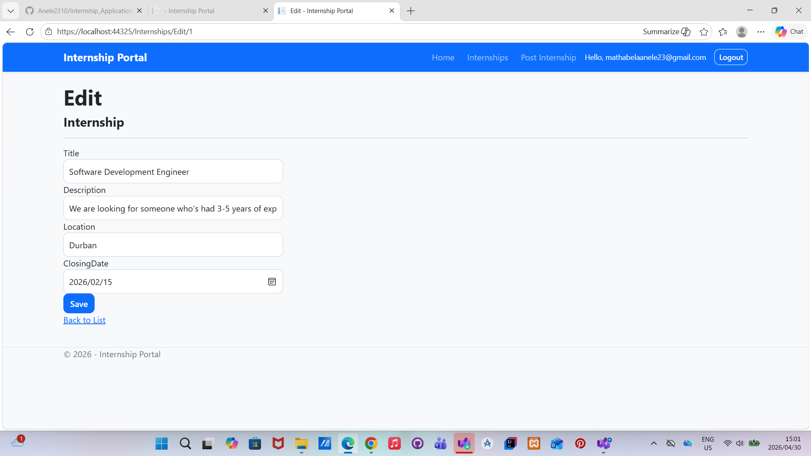

# Internship_Application_Management_System

## Overview
The Internship Application Management System is a web-based platform designed to help organizations manage internship opportunities and student applications efficiently.

This project was built to demonstrate full-stack development using ASP.NET Core MVC, Entity Framework Core, and SQL Server.

---

## Features

- User Registration and Login
- Role-Based Access Control (Admin / Applicant)
- Create, Read, Update, Delete internship listings
- Submit internship applications
- Manage applicant records
- Secure authentication and authorization
- Responsive UI using Bootstrap

---
## Authentication & Security

- ASP.NET Identity authentication system
- Secure password hashing
- Role-based authorization (Admin / User)
- Logout functionality with session clearing
- 
## Technologies Used

- C#
- ASP.NET Core MVC
- Entity Framework Core
- SQL Server
- Razor Views
- HTML5
- CSS3
- Bootstrap
- Git / GitHub

---

## System Architecture

The system follows the **MVC (Model-View-Controller)** architecture:

Client (Browser)
↓
Views (Razor Pages)
↓
Controllers (Business Logic)
↓
Models (Data Structure)
↓
Entity Framework Core
↓
SQL Server Database

---

## Installation

1. Clone repository
2. Open solution in Visual Studio
3. Update connection string in `appsettings.json`
4. Run migrations
5. Start application

---

## Screenshots
### Home Page

### Internship Listings

### Login Page

### Register Page

### Create Internship Page

### Edit Internship Page

---

## Future Improvements

- Email notifications
- Application Form
- Search and filtering
- Admin analytics dashboard

---

## 👨🏽‍💻 Author
- Anele Mathabela
- Bachelor of Science in Information Technology Graduate(majored in Software Development).
